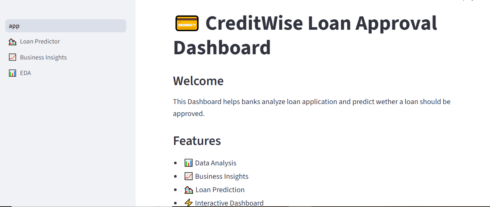
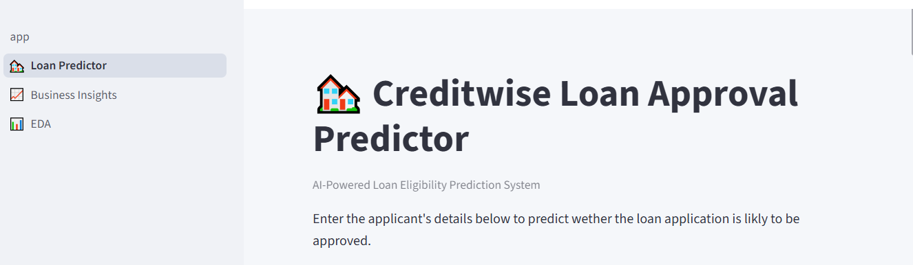
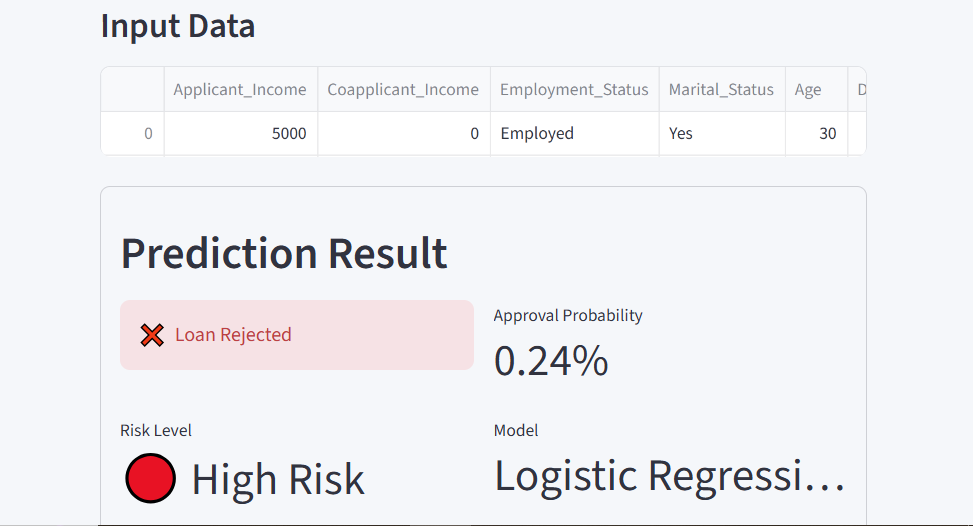
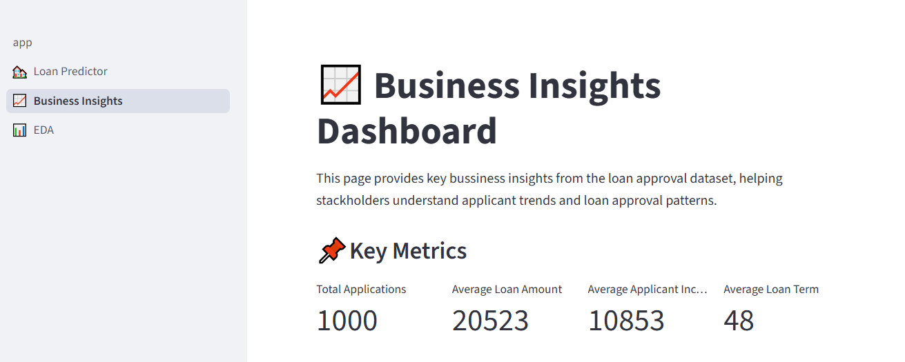
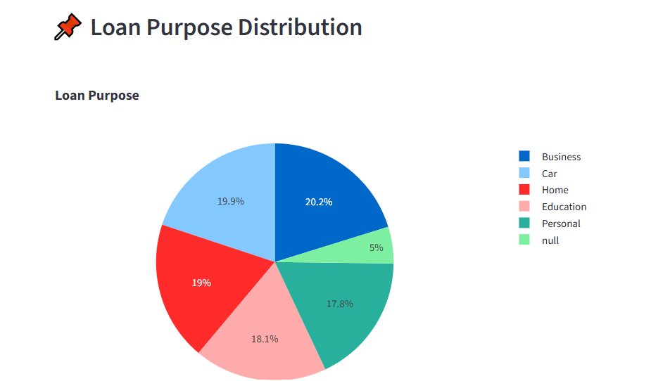
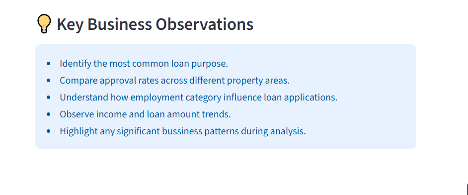
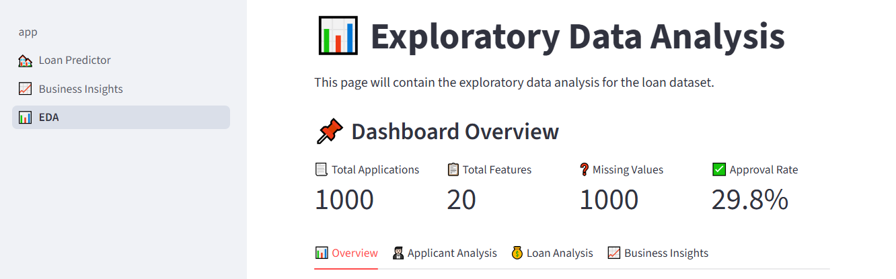
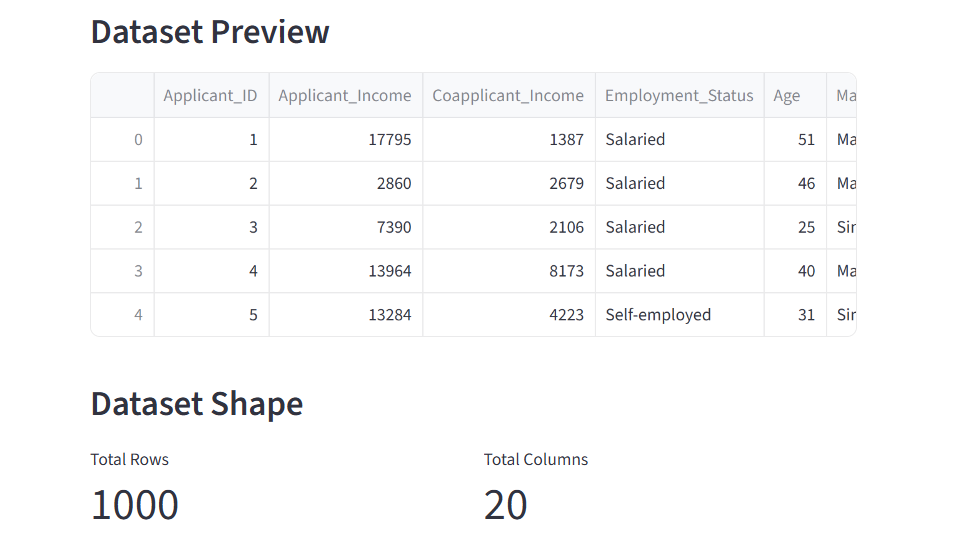
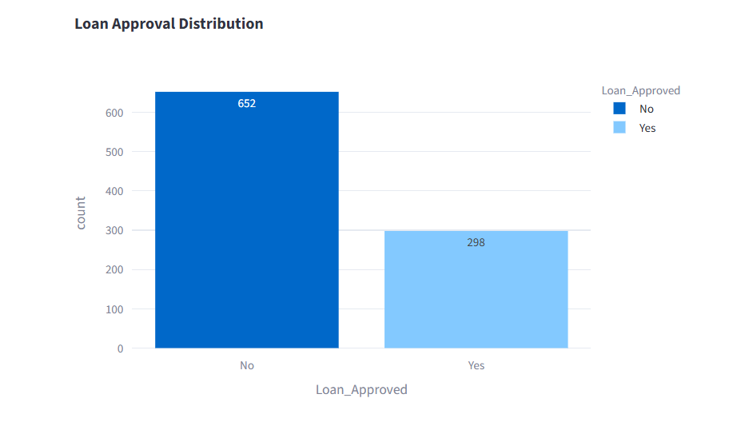
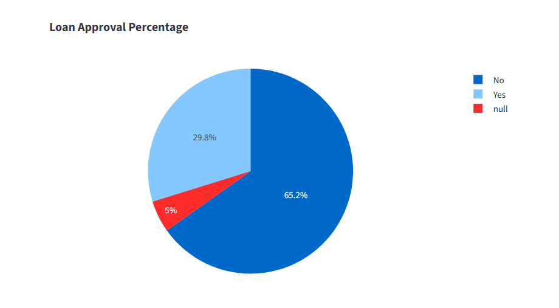

# 💳 CreditWise Loan Approval Dashboard 
An interactive Machine Learning-powered Loan Aproval Dashboard built using Streamlit. This application predicts loan approval based on applicant information and provides insights through interactive visualizations.

---
## 📌 Project Overview

CreditWise is an end-to-end machine learning application that predicts wether a loan application is likely to be approved. The dashboard also provides exploratory data analysis and business insights to help users better understand thedataset.


## ⚡ Key Features

- Loan Approval Prediction
- Business Insights Dashboard
- Exploratory Data Analysis (EDA)
- Machine Learning Pipeline
- Interactive Plotly Visualizations

## Tech stack

- Python
- Streamlit
- Pandas
- Numpy
- Scikit-learn
- Plotly
- joblib

## Project Structure

```text
CreditWise_Dashboard/
|-assets/
|-data/
|-model/
|-pages/
    |-📊 EDA.py
    |-📈 Business_Insights.py
    |-🏘️ Loan_Predictor.py
|-.gitignore
|-app.py
|-README.md
|-requirement.txt
```
## Screenshots
### Home


### Loan Predictor



### Business Insights




### Exploratory Data Analysis





## Installation
```bash
git clone ...
cd CreditWise_Dashboard
pip install -r requierments.txt
streamlit run app.py
```
If the above command doesn't work, use:
```bash
python -m pip install -r requirements.text
python -m streamlit run app.py
```

## Live Demo
https://creditwise-ai-dashboard.streamlit.app/

## Github Repository
https://github.com/roshnij26/Creditwise_Dashboard.git

## Author
Roshni Jaiswal